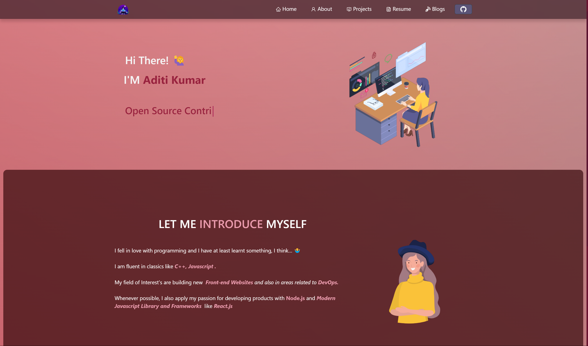

<h1 align="center">My Portfolio🎯</h1>
It is a React based Portfolio Web Application which is completely responsive and user friendly. It's a website where you can explore my journey, and see how my skills can benefit your projects.

</ul><h2>Technologies Used 🛠️</h2>
<ul>
<li>HTML</li>
</ul><ul>
<li>CSS</li>
</ul><ul>
<li>JavaScript</li>
</ul><ul>
<li>ReactJS</li>
</ul><ul>
 
<h2> Preview ⚡️</h2>

 

  

## Website 💻
//

</ul><h2> Features 🔥</h2>
✔️ Class and Functional Components  
✔️ State and Props  
✔️ Component Lifecycle Methods  
✔️ React Hooks  
✔️ Promises  
✔️ React Router  
✔️ Authentication and Authorization services to implement login functionality.  
  
## Usage 📋

To run this project on your device, clone the repository and open the terminal in your editor. Following are the requirements to run this project:
<h5>Code Examples</h5><ul>
<li>Clone the project</li>
</ul>
<code>git clone https://github.com/Aditi020/My-Portfolio </code>
<ul>
<li>Go to the project directory</li>
</ul>
<code>cd My-Portfolio </code>
<ul>
<li>Install dependencies</li>
</ul>
<code>npm install </code>
<ul>
<li>Start the server</li>
</ul>
<code>npm start</code>

## Disclaimer ❗️
A word of disclaimer, 
<ul><li>styled-components</li></ul>

<code>npm i styled-components</code>

<ul><li>react-icons</li></ul>

<code>npm i react-icons</code>

<ul><li>scrollreveal</li></ul>

<code>npm i scrollreveal</code>

## Contributing 💡
Contributions are always welcome!

See [CONTRIBUTIONS.md]([https://github.com/ADITI020/My-Portfolio/blob/main/CONTRIBUTING.md](https://github.com/Aditi020/My-Portfolio/blob/master/CONTRIBUTING.md)) for ways to get started.

Don't forget to leave a 🌟.

